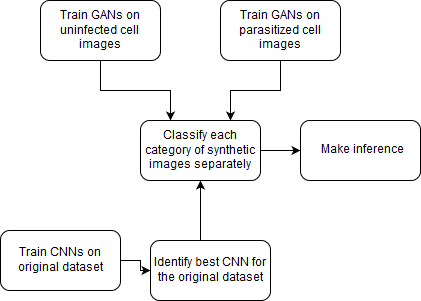

# BDIA-Project
## GANs for medical imaging

## Abstract

In this project, we observe the performance of Generative Adversarial Networks for medical imaging. In healthcare, there are a lot of privacy concerns which prevent researchers from accessing private medical scans and images of patients. Hence, with the little medical image data we have we would like to use GANs to create synthetic medical images. We trained our GANs on malaria blood cells (2 categories: parasitized, infected) for 15,000 epochs. We tested these synthetic images on a very accurate (95% validation accuracy) ResNet CNN which was trained on our original dataset. 30% of our parasitized cells were accurately predicted and 99% of our uninfected cells were accurately predicted.

## Workflow

## Dataset

https://ceb.nlm.nih.gov/repositories/malaria-datasets/

### Steps to run
- Run 'Parasitized_images_GAN.ipynb' to create synthetic parasitized images.
- Run 'Uninfected_images_GAN.ipynb' to create synthetic uinfected images.
- Synthetic data is automatically saved into zip files 'Parasitized.zip' and 'Uninfected.zip'.
- Unzip these files into the respective directories.
- Run 'testing_synthetic_images.ipynb' to predict synthetic images on our pretrained CNN model.
